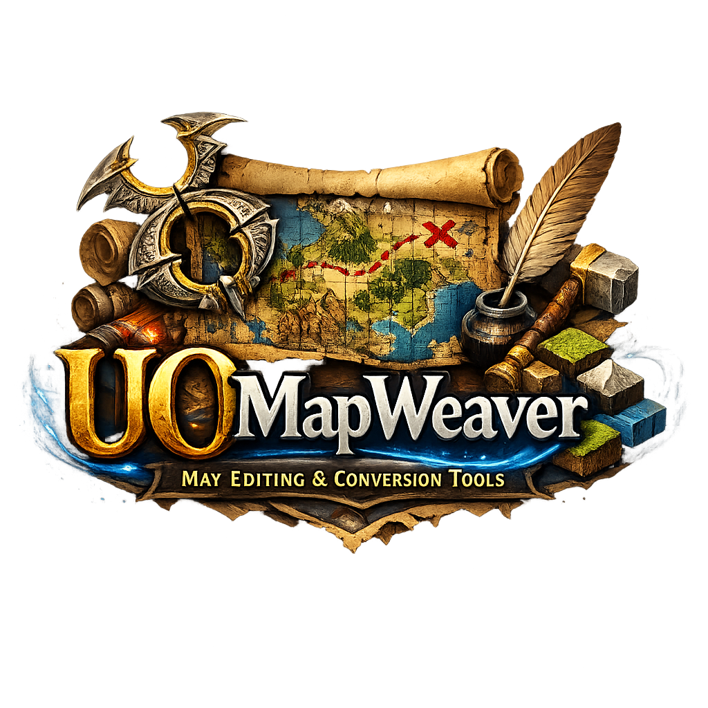

# UOMapWeaver
UOMapWeaver is a cross-platform tool for Ultima Online map files. It converts between
`.mul` terrain data and `.bmp` images for terrain and altitude, and lets you preview
or rebuild maps from images.

## Features
- Convert `map*.mul` (plus optional statics) to `*_Terrain.bmp` and `*_Altitude.bmp`.
- Convert `*_Terrain.bmp` and `*_Altitude.bmp` back to `map*.mul`.
- Convert terrain via Terrain XML (24-bit) with transition blending.
- Optionally write altitude BMP using `Altitude.xml` colors (24-bit) or grayscale (8-bit).
- Generate populated statics from terrain + transition definitions.
- Auto-detect map size from the `.mul` file.
- MapTrans profile support (built-in and custom profiles).
- Tile Color JSON mapping (8-bit indexed or 24-bit RGB).
- Terrain encoding selector (MapTrans, Tile JSON, or TileIndex RGB).
- Build tile color JSON from one or more `map.mul` files (incremental updates).
- Create blank BMP maps (8-bit palette or 24-bit RGB) with fill options.
- Minimal UI with previews and logs.
- Copy map regions (terrain + optional statics) between maps.
- Save and restore UI fields and options.

## Requirements
- .NET 10

## Notes
- Map sizes must be multiples of 8.
- If a terrain color is missing from a profile, the pixel is written as transparent.
- Tile color JSON can be used in place of MapTrans for conversions.
- TileIndex RGB stores the tileId directly in a 24-bit BMP (`R=tileId>>8`, `G=tileId&0xFF`, `B=0`) for lossless terrain round-trips.
- Static generation uses `UOMapWeaverData/Statics` plus terrain/transition definitions.
- UI state is saved in `UOMapWeaverData/ui-state.json` (next to the executable) when `Save Fields` is enabled.

## Terrain Encodings
- MapTrans: classic 8-bit palette based on MapTrans profiles.
- Tile JSON: palette-driven (Indexed8) or truecolor (RGB24) via a JSON tile table.
- TileIndex RGB: direct tileId encoding in 24-bit BMP (best for lossless edits, requires 24-bit terrain BMP).
- Terrain XML (24-bit): uses `Terrain.xml` + `Transitions` to encode terrain in RGB24.

## Data Folder
On first startup, the app creates `UOMapWeaverData` next to the executable and adds `README.txt` files in each folder.
No default data files are shipped; you must copy your own XML/TXT/ACT/BMP files into the folders listed below.

Key folders under `UOMapWeaverData`:

* **`MapTrans`**: MapTrans profiles (`Mod11.txt`, `Mod11.xml`, etc.).
* **`Transitions`**: transition XMLs for terrain blending.
* **`TerrainTypes`**: terrain type XMLs.
* **`Templates`**: 2-way/3-way template XMLs.
* **`RoughEdge`**: rough-edge XMLs.
* **`Palettes`**: 8-bit palette BMPs (ex: `TerrainPalette.bmp`).
* **`ColorTables/ACT`**: ACT palettes (`Terrain.act`, `Altitude.act`).
* **`Definitions`**: `map-definitions.json`, `terrain-definitions.json` (optional).
* **`Presets`**: `map-presets.json` (optional, for Blank BMP sizes).
* **`Statics`**: static placement JSONs (generated or user-supplied).
* **`Import Files`**: static import XMLs (optional).
* **`TileColors`** and **`JsonTileReplace`**: generated JSON outputs.

**Regenerate Defaults** recreates the folder structure and README files only.

## GenStatics Guide
Use the **GenStatics** tab to generate statics from terrain data:

1) Select `map.mul` and output folder.
2) Enable `Random statics` (biome-based) and/or `Transition statics`.
3) Optionally load `Terrain.bmp`/`Altitude.bmp` for transition statics.
4) Click `Generate`.

### Biome Overrides
The **Overrides** sub-tab lets you remap a biome to a different XML and adjust spawn chance.  
Enable `Override` to apply your edits; missing biome XMLs are reported in the log.

### Output
Generated files are `staidx.mul` and `statics.mul` in the chosen output folder.

## Map Copy Guide
The Map Copy tab copies a rectangular region from a source map to a destination map.

1) Select source and destination `map.mul` files.
2) Fill Source area (From X/Y -> To X/Y) and Destination start (X/Y).
3) Choose whether to copy terrain, statics, or both.
4) Click `Generate Preview BMPs` (optional) to visualize the copy.
5) Click `Copy Region`.

### Static Copy Modes
- Cell match (default): Scans each tile cell and copies only statics at that cell.
- Entry translate (alt): Reads each static entry and moves it to the destination by offset.
- Block replace (aligned): Copies whole 8x8 static blocks. Requires 8-aligned source/destination; the UI snaps to /8 when selected.

### Static Layout
Some maps store static blocks with a different ordering. Choose the layout that matches your files.
- Row-major blocks (default): index = blockY * blockWidth + blockX.
- Column-major blocks (alt): index = blockX * blockHeight + blockY.

If statics appear shifted or striped, switch to `Column-major blocks (alt)`.

### Static Z Options
- Keep Z: keeps the original static height.
- Offset by terrain: adjusts Z by the terrain height delta between source and destination.
- Set fixed Z: forces all copied statics to the specified Z.

### Tips
- Map sizes must be divisible by 8 for statics.
- For precise region copies, prefer Block replace (aligned) with 8-aligned coordinates.

## FAQ
**Why are statics shifted or striped after a copy?**  
Try switching the Static layout to `Column-major blocks (alt)`. Some maps store static blocks in a different order, and this fixes “striped” placements.

**Why are some statics floating or sunk?**  
Use `Statics Z` options. `Offset by terrain` adjusts heights based on the terrain delta between source and destination. `Set fixed Z` is useful for flattening or testing.

**Why do my copied statics look incomplete?**  
Make sure `Overwrite statics` is enabled and your source/destination rectangles are within bounds.

## Originality & Intellectual Property
**Source Code:** The source code of this application is entirely original. It has been developed and written by me with the assistance of AI. No code has been copied, decompiled, or extracted from *Map Creator*, *UO Landscaper*, *RadMapCopy*, or any other existing tools.

**Third-Party Tools:** This software acts as an independent orchestrator. It does not include, bundle, or distribute any proprietary binaries (.exe), engines, or configuration files (.xml) from other authors. All credits for external logic (when manually added by the user) belong to their respective creators (Gametec, dKnight, RadstaR, etc.).

## Support the Project
If UOMapWeaver saves you time, please consider a small donation.  
Your support helps cover development time and keeps improvements flowing (better conversions, previews, and tooling).  
No pressure — every contribution helps.
### ☕ Support my work

If you find this project useful, you can support my development by buying me a coffee via crypto:

* **Solana (SOL):** `H4amfKB18QUUwdHxNgCPLbzWxyXCwVnguhGkj8fcTocW`
<!-- * **USDT (Solana/SPL):** `YOUR_SOLANA_ADDRESS_HERE`  -->
<!--     > *Note: Please ensure you are sending USDT via the **Solana (SPL)** network.*  -->

